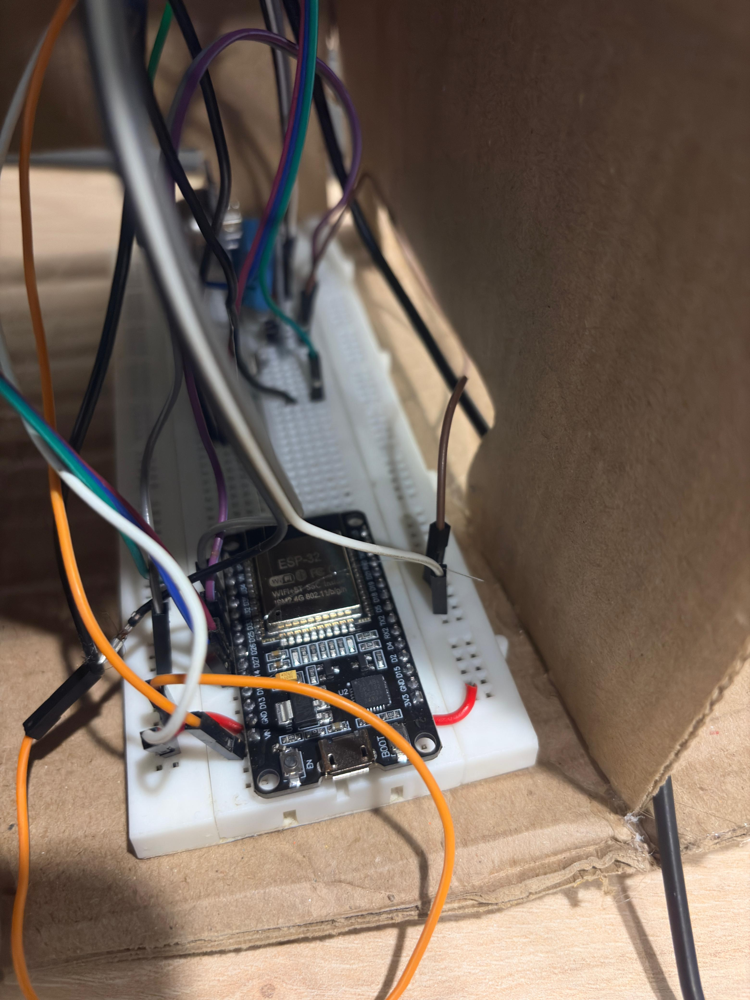
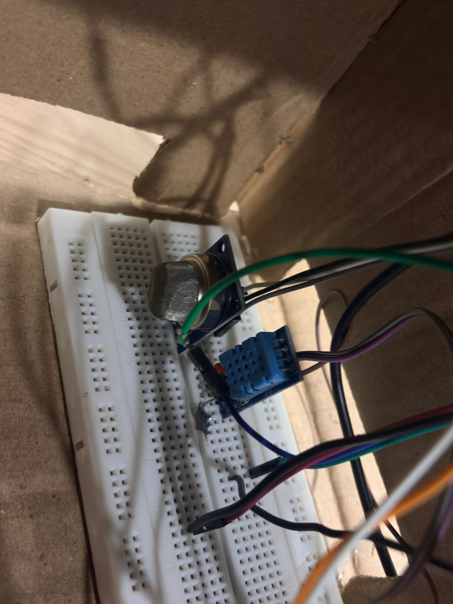
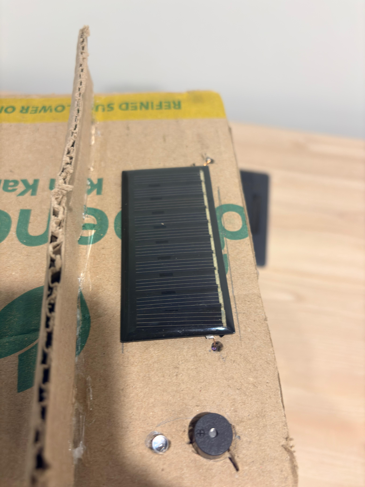

# Eco-Assist

Eco-Assist is an IoT-based agricultural monitoring and marketplace platform 
that combines real-time sensor data, AI-driven spoilage prediction, and a 
direct farm-to-buyer marketplace to reduce post-harvest crop loss and 
eliminate price manipulation by intermediaries.

---

## Overview

Post-harvest losses account for a significant portion of agricultural waste 
in India. Eco-Assist addresses this through a network of solar-powered IoT 
nodes that continuously monitor storage conditions, predict spoilage risk 
using sensor fusion algorithms, and provide farmers with a direct channel to 
sell verified produce to buyers without intermediaries.

---

## Architecture

The system consists of three layers:

**Hardware Layer**
ESP32-CAM microcontrollers equipped with BME280 (temperature, humidity, 
pressure), MQ-135 (VOC and ethylene), and MQ-137 (ammonia) sensors. Each 
node is solar-powered with a Li-ion battery management system and transmits 
data over MQTT.

**Backend Layer**
FastAPI application that ingests sensor telemetry, computes health scores, 
manages user authentication, and serves a REST API with WebSocket support 
for real-time dashboard updates.

**Frontend Layer**
React-based web application with two separate portals — one for farmers and 
one for buyers — communicating with the backend over HTTP and WebSocket.

---

## Features

**Farmer Portal**
- Real-time telemetry dashboard showing temperature, humidity, VOC, and 
  ammonia readings from connected ESP32 devices
- AI-computed crop health score (0 to 100) derived from sensor fusion
- Camera feed from ESP32-CAM with mold and sprout detection overlay
- Automated spoilage alerts delivered via WebSocket when risk is detected
- Produce listing management to add items for sale with quantity and price

**Buyer Portal**
- Browse active produce listings verified by the Eco-Assist health algorithm
- View full sensor history for any listing before making a purchase decision
- Submit price offers directly to farmers
- Negotiate and finalize deals without any intermediary

---

## Tech Stack

| Component | Technology |
|-----------|-----------|
| Frontend | React, Vite, Recharts, Framer Motion |
| Backend | FastAPI, Python 3.11, SQLAlchemy, asyncpg |
| Database | PostgreSQL |
| Real-time | WebSockets, MQTT (EMQX broker) |
| IoT Hardware | ESP32-CAM, BME280, MQ-135, MQ-137 |
| AI / Detection | YOLOv8, custom sensor fusion algorithm |
| Authentication | JWT (python-jose, passlib) |

---

## Getting Started

### Prerequisites

- Python 3.11 or higher
- Node.js 20 or higher
- PostgreSQL 15 or higher
- An MQTT broker (EMQX Cloud free tier or local)

### Database Setup

Create a PostgreSQL database named `eco_assist`, then run the schema:

```bash
psql -U postgres -d eco_assist -f backend/schema.sql
```

### Backend

```bash
cd backend
pip install -r requirements.txt
cp .env.example .env
```

Edit `.env` with your database credentials and MQTT broker details, then:

```bash
uvicorn main:app --reload
```

The API will be available at `http://localhost:8000`.  
Interactive API documentation is available at `http://localhost:8000/docs`.

### Frontend

```bash
cd frontend
npm install
npm run dev
```

The application will be available at `http://localhost:5173`.

---

## Demo

To populate the database with sample data:

```bash
cd backend
python seed_demo.py
```

To simulate live ESP32 sensor data without physical hardware:

```bash
cd backend
python simulate_esp32.py
```

This sends sensor readings to the backend every 5 seconds, including 
occasional high-risk readings to trigger the spoilage alert system.

### Sample Credentials

| Role | Email | Password |
|------|-------|----------|
| Farmer | farmer1@demo.com | demo123 |
| Farmer | farmer2@demo.com | demo123 |
| Buyer | buyer1@demo.com | demo123 |
| Buyer | buyer2@demo.com | demo123 |


---

## Hardware Images

### Project Overview


### ESP32 Setup


### Sensors


### Solar Panel


### Solar and Buzzer


### Onions Used for Testing


---

## License

MIT

---

## API Reference

| Method | Endpoint | Description |
|--------|----------|-------------|
| POST | /auth/register | Create a new farmer or buyer account |
| POST | /auth/login | Authenticate and receive a JWT token |
| GET | /auth/me | Return the current authenticated user |
| POST | /ingest/telemetry | Receive sensor data from an ESP32 node |
| POST | /ingest/camera | Receive a camera snapshot from ESP32-CAM |
| GET | /farmer/dashboard | Latest telemetry for all farmer devices |
| GET | /farmer/telemetry/{device_id} | Historical sensor readings |
| POST | /farmer/listings | Create a new produce listing |
| GET | /market/listings | All active verified listings |
| POST | /market/bid | Submit a price offer on a listing |
| WS | /ws/{farmer_id} | WebSocket stream for live alerts |

---

## Project Structure

```
eco-assist/
├── backend/
│   ├── main.py
│   ├── db.py
│   ├── schema.sql
│   ├── requirements.txt
│   ├── seed_demo.py
│   ├── simulate_esp32.py
│   ├── routers/
│   │   ├── auth.py
│   │   ├── ingest.py
│   │   ├── farmer.py
│   │   └── marketplace.py
│   └── services/
│       ├── health_score.py
│       └── alert_service.py
└── frontend/
    └── src/
        ├── App.jsx
        ├── index.css
        ├── pages/
        │   ├── LandingPage.jsx
        │   ├── FarmerDashboard.jsx
        │   ├── BuyerMarketplace.jsx
        │   ├── Register.jsx
        │   ├── FarmerLogin.jsx
        │   └── BuyerLogin.jsx
        └── components/
```


## Health Score Algorithm

The crop health score is computed from four sensor inputs using a 
weighted deduction model:

- Base score starts at 100
- Temperature outside the 2 to 8 degree Celsius optimal range deducts 
  10 to 30 points depending on severity
- Humidity below 70% or above 98% deducts 10 to 15 points
- VOC levels above 200 ppm (ethylene buildup) deduct 12 to 25 points
- Ammonia levels above 25 ppm (rot indicator) deduct 20 to 35 points

Scores above 75 are classified as low risk, 50 to 75 as medium, 
25 to 50 as high, and below 25 as critical.


## Environment Variables

| Variable | Description |
|----------|-------------|
| DATABASE_URL | PostgreSQL connection string |
| JWT_SECRET | Secret key for signing JWT tokens |
| MQTT_BROKER_HOST | MQTT broker hostname |
| MQTT_PORT | MQTT broker port (default 1883) |
| MQTT_USERNAME | MQTT broker username |
| MQTT_PASSWORD | MQTT broker password |

